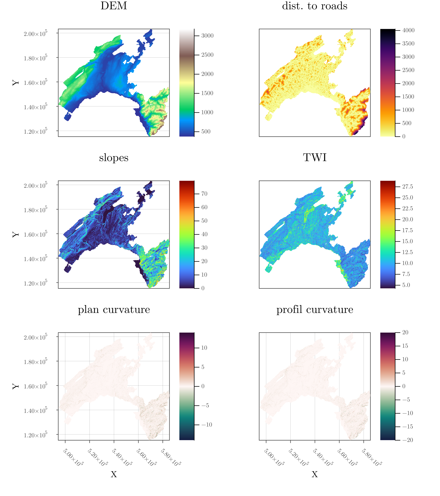
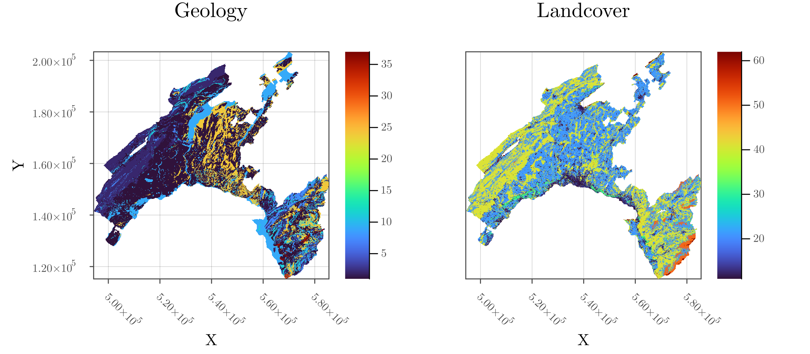
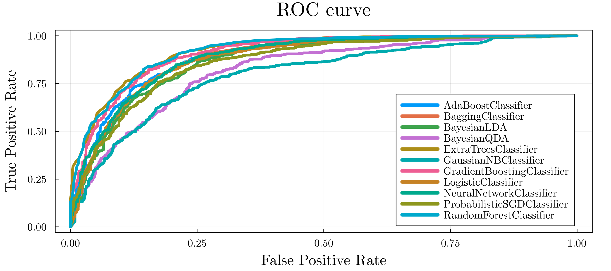
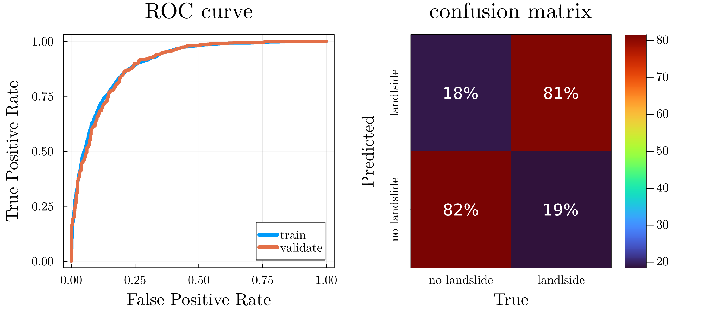
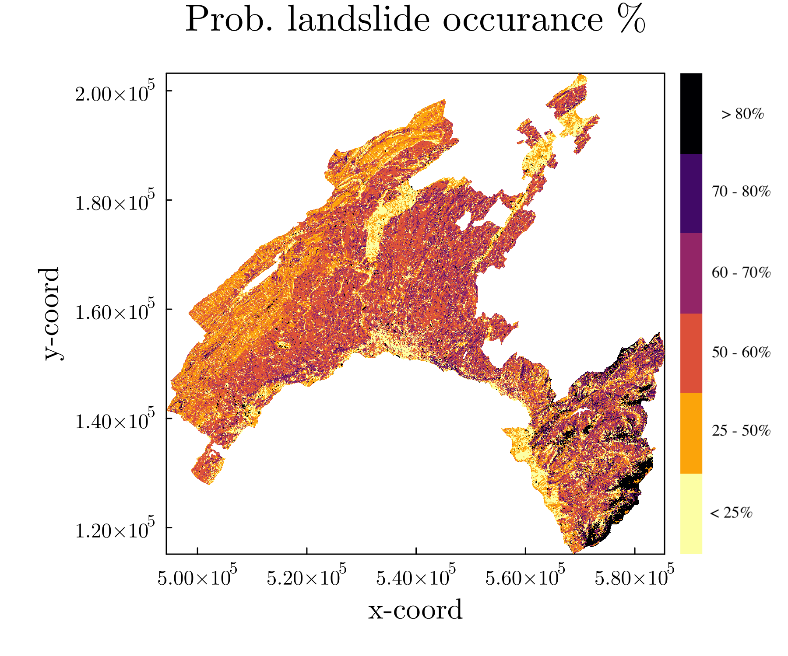
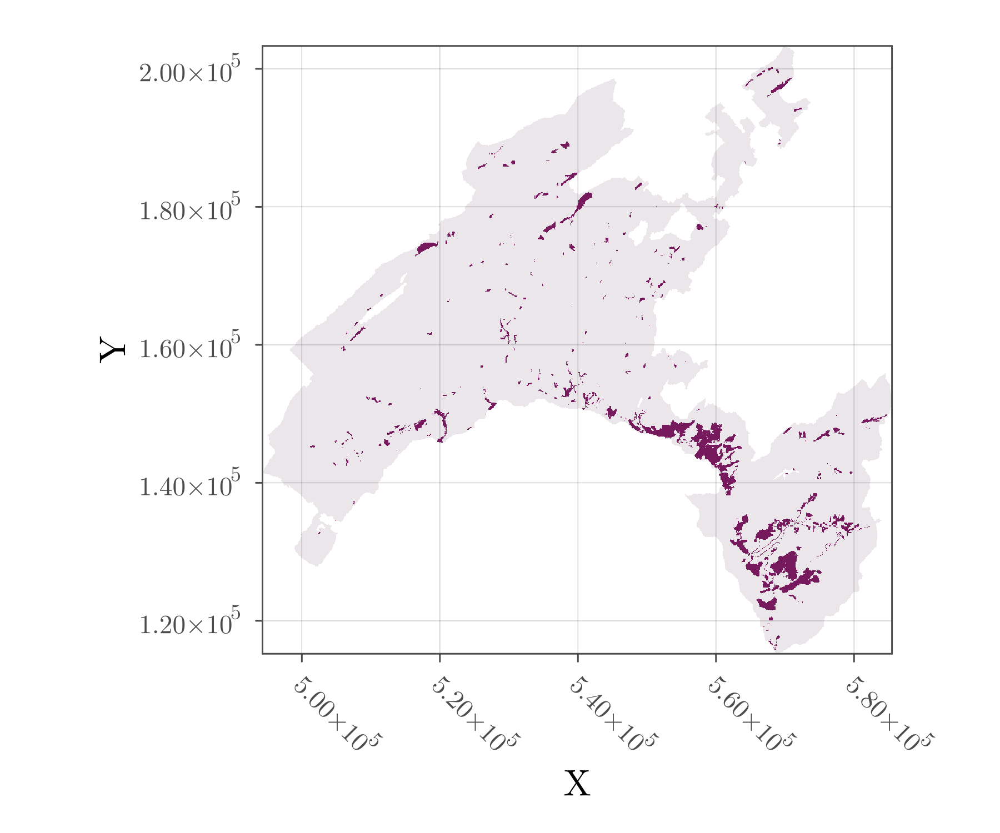

# ML² - machine learning on landslide
Julia-based workflow to predict where landslides are most likely to occur in Canton de Vaud (CH) based on the provided locations of past events and the (potential) landslide predictors:
- Digital Elevation Model (DEM)
- Slope
- Plan curvature
- Profile curvature
- Topographical water index (TWI)
- Land cover
- Geology types
- Distance to nearest road

**Most of the workflow relies on [`MLJ.jl`](https://alan-turing-institute.github.io/MLJ.jl/dev/), _A Machine Learning Framework for Julia_.**

## Examining the dataset
The area of interest is the canton de Vaud, Switzerland. The data set is composed of 8 GeoTif rasters; 6 have continuous features:
<p align="center">  </p>

The remaining 2 sets represent discrete or categorical classes:
<p align="center">  </p>

### Input data as `CSV` file
The `Landslides.csv` file contains a subset of the data including the dependent variable `LS` which reports the presence/absence of landslides. Using `CSV` and `DataFrames.jl` Julia packages, we can load and examine the dataset, which contains 5185 entries:
```julia
julia> df = CSV.File(input_file) |> DataFrame
5185×9 DataFrame
  Row │ dist_roads  DEM      TWI       plan_curvature  profil_curvature  Slope     Geology  LandCover  LS
      │ Float64     Float64  Float64   Float64         Float64           Float64   Int64    Int64      Int64
──────┼──────────────────────────────────────────────────────────────────────────────────────────────────────
    1 │    90.1388    957.1  10.0174      0.00257542        1.56e-5      11.0455         2         41      0
    2 │   282.843     536.1   9.21162    -0.00012923       -0.000289093   3.57188        1         21      0
    3 │    90.1388    768.1  10.0824      0.00623542       -0.00240442   44.0343         2         41      0
    4 │    79.0569    449.4   7.35267     0.00420136        0.00116142   11.3254        24         21      1
    5 │    25.0       784.8   8.60168     0.00208871       -0.00271119   19.0155         1         41      1
    6 │    25.0       991.5  13.7942     -0.00129205        0.00126791    8.28275        9         21      0
    7 │    35.3553    569.2   8.86016    -0.00346738        0.00069258   23.9199        24         31      1
    8 │    70.7107   1211.4   9.46106    -0.00180184       -0.00452195   21.2627         9         21      0
  ⋮   │     ⋮          ⋮        ⋮            ⋮                ⋮             ⋮         ⋮         ⋮        ⋮
 5178 │   550.568    1499.2   8.42238     0.00542759       -0.00193218    7.82544        2         21      0
 5179 │   195.256    1338.4   8.78591     0.00222917        0.00286882   15.9947         1         21      1
 5180 │    55.9017    495.9  10.3554     -0.000160022       0.000159998   3.41456        9         21      0
 5181 │    70.7107    443.4  11.9715     -0.000120202       3.99e-5       1.58431        9         21      0
 5182 │    55.9017    460.6  11.8599      6.4e-5            0.000383965   4.04307        9         31      0
 5183 │    55.9017   1032.8  11.8693     -0.000550569      -7.09e-5       4.75323        1         21      0
 5184 │   458.939     895.5   8.91429    -0.003389          0.00749098   33.9126        11         41      1
 5185 │   500.0       576.2   9.6554      0.000434234       0.000594097   2.29349        1         41      0
                                                                                            5169 rows omitted
```
To have a better overview of the data, we can inspect the metadata, including column scientific types using `schema(df)`:
```julia
julia> schema(df)
┌──────────────────┬────────────┬─────────┐
│ names            │ scitypes   │ types   │
├──────────────────┼────────────┼─────────┤
│ dist_roads       │ Continuous │ Float64 │
│ DEM              │ Continuous │ Float64 │
│ TWI              │ Continuous │ Float64 │
│ plan_curvature   │ Continuous │ Float64 │
│ profil_curvature │ Continuous │ Float64 │
│ Slope            │ Continuous │ Float64 │
│ Geology          │ Count      │ Int64   │
│ LandCover        │ Count      │ Int64   │
│ LS               │ Count      │ Int64   │
└──────────────────┴────────────┴─────────┘
```
Having categorical data (`Count`) is reserved for counting finite quantities. Here, we thus want to coerce the scitype `Count` data into `OrderedFactor` or `Multiclass`. The coerced data can then be further transformed using a `OneHotEncoder` in order to split the categorical data into new boolean variables, e.g.,
```
Geology | 24  ->  Geology__24 | 1
```
Next we can separate the target variable `y` from the feature set `X`:
```julia
y, X = unpack(df2, ==(:LS))
```
standardise it, and split among train and test data:
```julia
train, test = partition(collect(eachindex(y)), 0.7, shuffle=true, rng=5)
```
Now that our data set is ready, we can proceed trying to find an appropriate model.

## Training a model
### Model comparison
`MLJ.jl` offers a wide variety of ML models that can be used to predict the probability of landslide occurrence, with their relative performance, here comparing upon their relative receiver operating characteristic (ROC) curves, which compares models' sensitivity (_true positive rate_) as function of specificity (_false positive rate_):
<p align="center">  </p>

Selecting a well-performing model for the target data-set is important, and `MLJ.jl` offers a nice framework to access many different ones that would fit the input data:
```julia
     │ Model                       Accuracy  Mean_x_entropy  f1_scores
─────┼─────────────────────────────────────────────────────────────────
   1 │ ExtraTreesClassifier        0.840617  0.361647        0.844025
   2 │ RandomForestClassifier      0.836761  0.36531         0.837803
   3 │ GradientBoostingClassifier  0.832905  0.376083        0.833972
   4 │ NeuralNetworkClassifier     0.814267  0.420713        0.822372
   5 │ AdaBoostClassifier          0.809769  0.662655        0.808538
   6 │ LogisticClassifier          0.809126  0.440596        0.808757
   7 │ BaggingClassifier           0.803985  1.02093         0.798414
   8 │ ProbabilisticSGDClassifier  0.803342  0.489827        0.806818
   9 │ BayesianLDA                 0.789846  0.454157        0.792117
  10 │ BayesianQDA                 0.738432  1.18214         0.727029
  11 │ GaussianNBClassifier        0.73329   1.31859         0.718262
  ```
We see that models 1-4 show interesting performance metrics. Let's also have a brief look at the code to see how to implement the training framework:

> code: [`model_train.jl`](model_train.jl) and selecting `run = :multi` as run type.

### Selected model
We can now load specifically the neural net classifier from `Flux.jl` as
```julia
clf = @load NeuralNetworkClassifier pkg=MLJFlux verbosity=0
```
and apply it to our training data. Besides reporting the receiver operating characteristic (ROC) curve, we can also analyse the confusion matrix predicting the probability of landslide occurrence that we obtained using the Julia native `NeuralNetworkClassifier` (from `MLJFlux`), accessible within the `MLJ.jl` package,

<p align="center">  </p>

and the corresponding metrics: 
```
Model evaluation metrics
- cross entropy loss: 0.3631387528119737
- accuracy: 0.8412596401028278
- f1 score: 0.8441640378548896
```

In addition, running the model with the `RandomForestClassifier`, we can extract the relative importance of the features:
```
     │ Features          Importance
─────┼───────────────────────────────
   1 │ Slope             0.257315
   2 │ dist_roads        0.166931
   3 │ profil_curvature  0.1255
   4 │ DEM               0.11163
   5 │ TWI               0.111239
   6 │ plan_curvature    0.0994526
```

Note that we tuned the model to include more minimisation iterations in order to achieve better convergence and executed the training on the GPU:
```julia
CLF = clf(epochs = 300,            # iterations
          batch_size = 5,          # sub-grouping for faster processing
          lambda = 0.01,           # regularisation
          alpha = 0.01,            # L1 - L2 norm ratio
          acceleration=CUDALibs()) # GPU
CLF.optimiser.eta = 0.001          # learning rate -> relaxation parameter
```
Let's have a brief look at the code as well:

> code: [`model_train.jl`](model_train.jl) and selecting `run = :single` as run type.

## Application to canton de Vaud
We can now apply our trained machine or model in order to map the probability of landslide occurrence over the entire canton de Vaud. To do so, we perform following steps:
- process the GeoTif files combining all data into a single DataFrame
- coerce and `OneHotEncode` the categorical data, making sure the number of classes match the number from the  training set (otherwise we'll get erroneous results or the machine will fail)
- normalise the data set
- treat the `missing` values in an appropriate way

The output of the model is the probability of landslide occurrence (%), here reported in 6 classes:
<p align="center">  </p>

```
class │ Prob. landslide
──────┼─────────────────
    6 │ > 0.8
    5 │ 0.7  - 0.8
    4 │ 0.6  - 0.7
    3 │ 0.5  - 0.6
    2 │ 0.25 - 0.5
    1 │ < 0.25
```

The application code is fairly simple, as it mostly does preprocessing and needs simply to load the trained machine.

> code: [`model_use.jl`](model_use.jl) and loading the previously trained machine.

### Qualitative comparison to landslide data
The following figure depicts the observation of landslide occurrence in canton de Vaud:

<p align="center">  </p>

We see the trained ML model captures somewhat the trend but the fit is not that outstanding yet.

## Food for thoughts
Let's finally reflect on the predictability or output of the model, and how to select the "best" ones.

#### Data-science and predictions
- The 4 main features showing highest relative importance include: `Slope`, `dist_roads`, `profil_curvature`, `DEM`. Interestingly, the distance to nearest road is listed there. It may be actually a bias from the training data as landslides are not most likely to occur close to roads, but are certainly more accurately mapped and monitored close to roads.
- Additional manual tuning could be applied to optimise the training process - I here used the default or tried some improvement.
- Data preprocessing and conversion from `Count` to `OrderedFactor` or `MultiClass` types using the `OneHot` approach may be done differently. In particular, different approaches to normalise the data could be tested and maybe realised "carefully".
- Spatial aggregation of the output data may be justified to remove some pixel-effects (using e.g. some Gaussian filters, K-mean, etc...).
- Generating more realisation in order to get a statistically relevant sample may circumvent the rather variability in the results.
- More care should be ported to post-processing the data, including generating appropriate probability classes, maps, etc...
- Although giving better results in the ROC curves, it seems that the `RandomForestClassifier` and `ExtraTreesClassifier` suffer from over-fitting as the application to real data delivers poor spacial distributions

#### Numerics and optimisations
- Work with reduced precision (`Float32`)
- Further perform "on-the-fly" computations to avoid using too much memory
- Further leverage GPU acceleration
- Julia specific: type stability, packaging and more

## `small print`
### Packages used
This code uses, `MLJ`, `PrettyPrinting`, `CSV`, `DataFrames`, `Rasters`, `Statistics` and `Plots`.

### Alternative
This problem can also be adressed using an Artificial Neuron Network (ANN) approach based on [Flux](https://github.com/FluxML/Flux.jl) "only": [https://github.com/tduretz/Landslides_ANN](https://github.com/tduretz/Landslides_ANN)

### References
- Tonini, M.; D’Andrea, M.; Biondi, G.; Degli Esposti, S.; Trucchia, A.; Fiorucci, P. A Machine Learning-Based Approach for Wildfire Susceptibility Mapping. The Case Study of the Liguria Region in Italy. Geosciences 2020, 10, 105. https://doi.org/10.3390/geosciences10030105
- Park, S.; Kim, J. Landslide Susceptibility Mapping Based on Random Forest and Boosted Regression Tree Models, and a Comparison of Their Performance. Appl. Sci. 2019, 9, 942. https://doi.org/10.3390/app9050942
- https://juliaai.github.io/DataScienceTutorials.jl/end-to-end/
